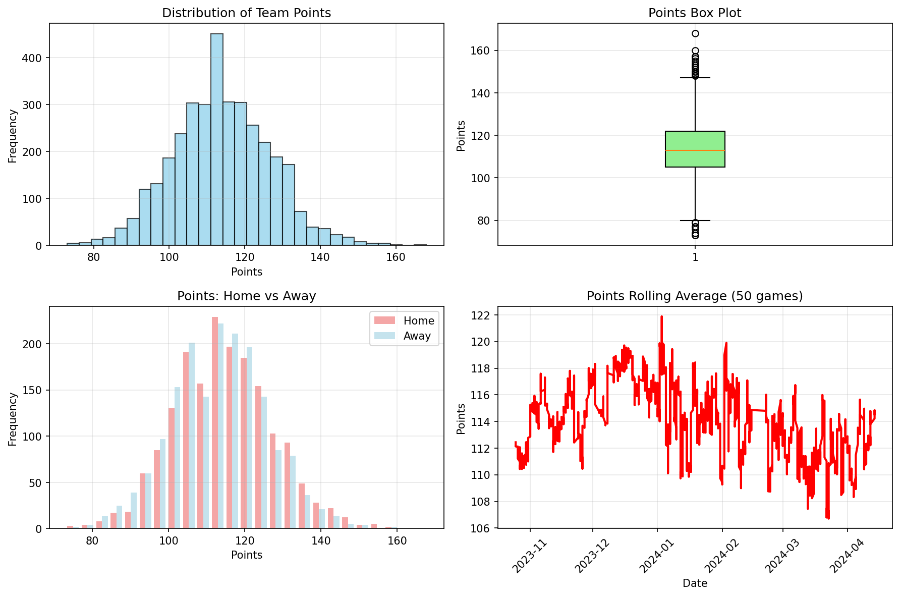
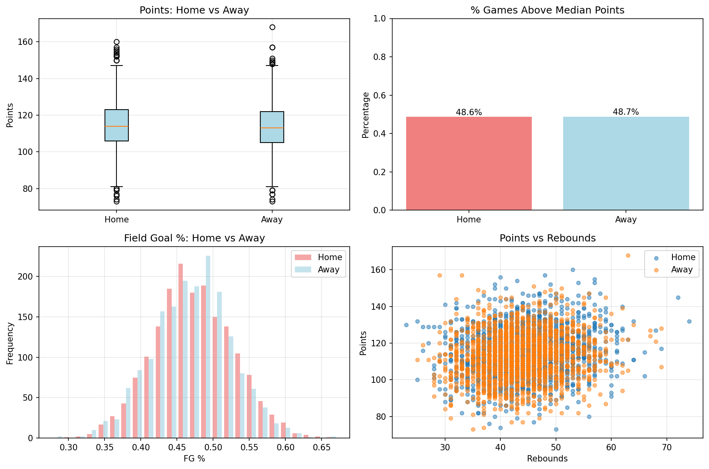
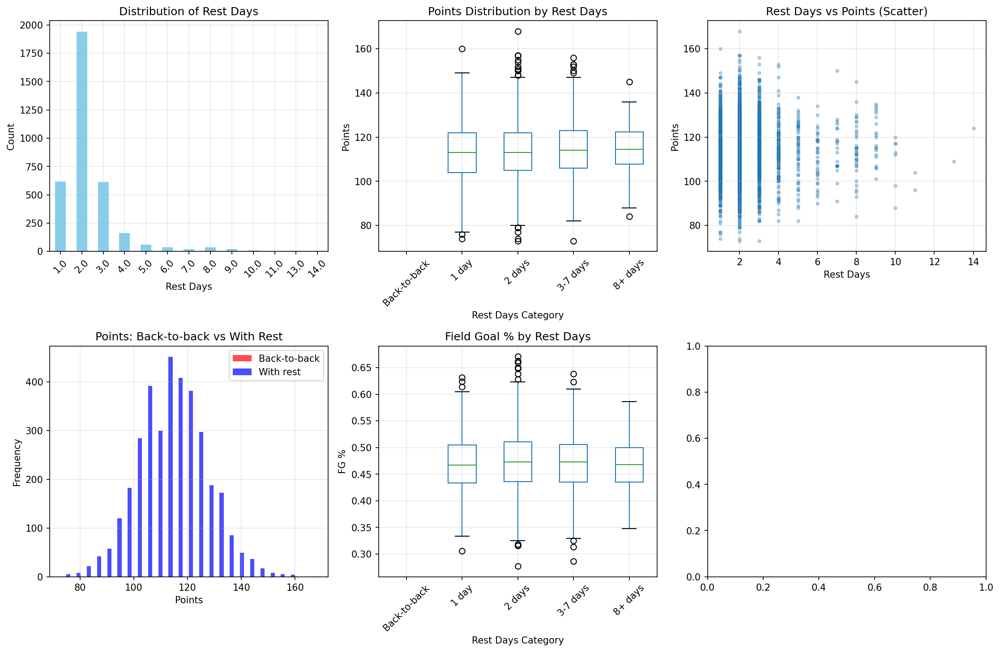
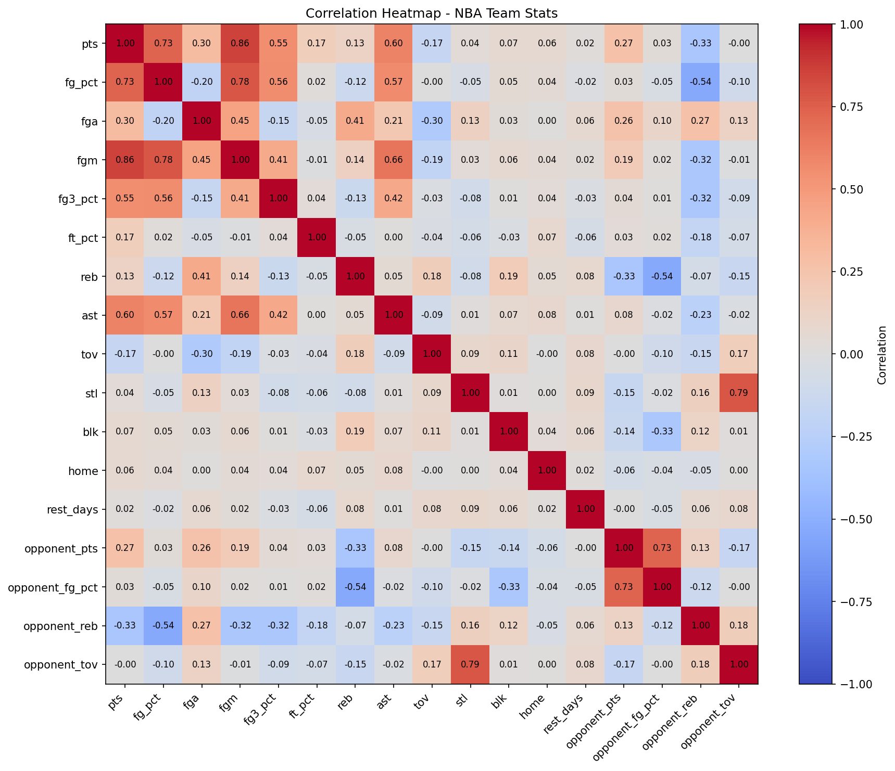
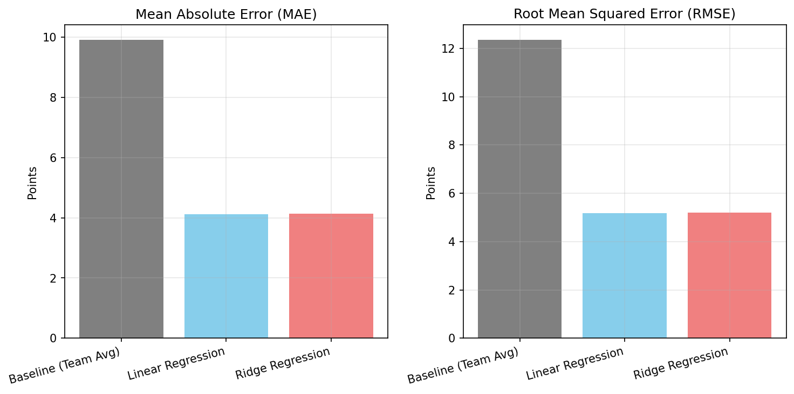
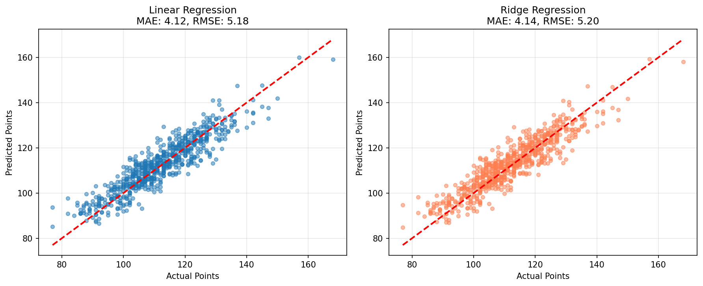
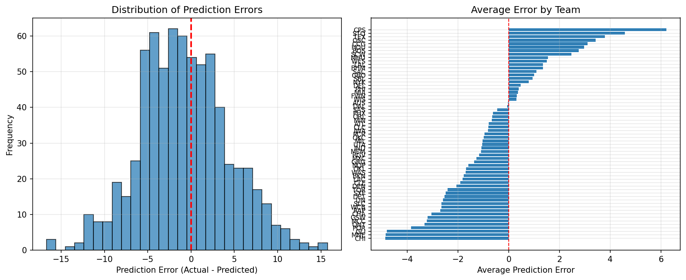

# NBA Team Outcome Prediction Project - Final Report

## Presentation (TO-DO)

[](https://www.youtube.com/watch?v=[REPLACE)

## How to Build and Run the Code

This section outlines how to reproduce the workflow.

**Prerequisites**
- Python 3.10 or higher
- git

**1. Clone the repository**

```bash
git clone https://github.com/justin9668/cs506-final-project
cd cs506-final-project
```

**2. Create and activate a virtual environment (example with conda)**

```bash
conda create -n nba python=3.11 -y
conda activate nba
```

**3. Install dependencies**

```bash
make setup
```

**4. Pull raw NBA data**

```bash
make pull
```

This retrieves the 2023–24 regular season game logs and saves them to `data/raw/team_gamelogs.csv`.

**5. Clean and process the data**

```bash
make clean_data
```

This produces the modeling ready dataset at `data/processed/team_games_clean.csv`.

**6. Verify the processed dataset**

```bash
make verify
```

The script checks that:
- Each game appears exactly twice
- Required columns such as `pts`, `fg_pct`, `reb`, `tov`, and `opponent_pts` are present
- The date range covers the full regular season

**7. Run the modeling notebook**

Open `notebooks/04_model.ipynb` and execute all cells. This trains the Linear Regression model, evaluates performance, writes predictions to `data/processed/test_predictions.csv`, and saves the model to `models/final_linear_regression.joblib`.

**8. Run automated tests** (TO-DO)

```bash
make test
```

This runs the unit tests in `tests/` and validates the pipeline. The same tests run automatically through GitHub Actions.

---

## Test Code and Continuous Integration

The project includes a focused test suite with 27 tests across three files.

**Test suite**
- `tests/test_data_pipeline.py` (15 tests)  
  Validates data existence, structure, integrity checks (W/L consistency, plus/minus symmetry, points matching, home/away balance), percentage ranges, and realistic NBA statistics.
- `tests/test_data_cleaning.py` (8 tests)  
  Tests individual cleaning functions: column normalization, home/away flag detection, and rest days calculation.
- `tests/test_model_sanity.py` (4 tests)  
  Verifies model training, reasonable predictions (70-160 points), and improvement over baseline.

**Makefile integration**  
`make test` runs all tests using `pytest`.

**GitHub Actions workflow**  
The workflow installs dependencies, runs data pulling and cleaning, and executes the test suite to confirm that data processing and modeling function as expected.

---

## Visualizations of the Data

Exploratory figures illustrate scoring patterns and feature relationships for the 2023–24 season. All visualizations are stored in `img/`.

### Points Distribution



Most point totals fall between 100 and 120, with a few outliers caused by overtime or unusually low scoring games.

### Home vs. Away Performance



Teams score slightly more at home, indicating a modest home court advantage.

### Rest Days and Performance



Point totals and field goal percentage remain steady across rest categories, suggesting minimal performance decline during tighter schedules.

### Feature Correlation Heatmap



Expected relationships appear:
- Strong positive correlations between scoring and both field goals made and field goal percentage
- Moderate positive correlations for three point percentage and assists
- Weak negative correlation with turnovers
- Opponent rebounds tend to decrease when teams shoot well

### Model Comparison and Error Analysis







These figures compare the models, display predicted versus actual scores, and summarize residual patterns. Most errors fall within ten points, with limited systematic bias.

---

## Data Processing and Modeling Pipeline

We model each team's point total per game and derive the game winner from those predicted scores.

### Data Pipeline

**Source**  
Game logs are pulled from the NBA Stats API using `nba_api` (`LeagueGameFinder`) for 2023–24 regular season.

**Raw data retrieval** (`make pull`)  
The script downloads the full season logs and writes them to `data/raw/team_gamelogs.csv`.

**Cleaning and feature engineering** (`make clean_data`)  
The cleaning step produces a modeling ready table by:
- Standardizing column names, parsing dates, and restricting rows to the thirty NBA teams
- Creating a `home` indicator by parsing the matchup field
- Computing `rest_days` for each team by comparing consecutive game dates
- Merging each team row with its opponent's stats based on `game_id`
- Enforcing two rows per game to ensure consistent pairing
- Exporting `data/processed/team_games_clean.csv` with box score fields, engineered variables, and opponent features

**Verification** (`make verify`)  
Checks that each game appears twice and that required columns are present.

### Modeling Pipeline

**Train–test split**  
A chronological 80–20 split is used so the model is trained only on earlier games and tested on later ones.

**Target**  
Team points scored (`pts`).

**Features**  
Game context (`home`, `rest_days`), team box score measures (`fg_pct`, `fga`, `fgm`, `reb`, `ast`, `tov`), and corresponding opponent statistics.

**Baseline**  
Team season average points: MAE 10.15, RMSE 12.54.

**Final model**  
A Linear Regression model reduces the error to MAE 4.08 and RMSE 5.14. This represents a substantial improvement over the baseline.

**Winner prediction**  
For each game, the team with the higher predicted score is taken as the predicted winner. Accuracy reaches 0.818, compared with 0.522 for always picking the home team.

**Outputs**  
Predictions are saved to `data/processed/test_predictions.csv`; the trained model is saved to `models/final_linear_regression.joblib`.

---

## Results and Discussion

### Regression Performance

The Linear Regression model reduces MAE and RMSE by more than half relative to the season average baseline. Plots show close alignment between predicted and actual scores. Residuals cluster near zero, with most errors within ten points.

### Winner Prediction Performance

The score based winner prediction achieves 0.818 accuracy, a significant improvement over the 0.522 home team baseline. This shows that the model captures meaningful differences in team performance beyond home advantage.

### Conclusion

The project provides a complete workflow for data retrieval, preparation, validation, and modeling. The Linear Regression model uses basic contextual and opponent features to produce strong results for both point prediction and game outcome inference. The structure supports future extensions, including richer feature sets or alternative modeling approaches.
